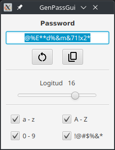

# GenPassGui
Generador de contraseñas

## Descripción
GenPassGui es una aplicación de escritorio para generar contraseñas seguras de manera rápida y sencilla. La aplicación permite personalizar la longitud y los caracteres incluidos en las contraseñas generadas.



## Características
- Generación de contraseñas seguras
- Personalización de longitud de la contraseña
- Inclusión de caracteres especiales, números y letras mayúsculas/minúsculas
- Interfaz gráfica de usuario intuitiva

## Requisitos
- Java 11 o superior
- Maven 3.6.0 o superior

## Instalación
1. Clona el repositorio:
   ```sh
   git clone https://github.com/TRuHa83/GenPassGui.git
   ```

2. Navega al directorio del proyecto:
    ```shell
    cd GenPassGui
    ```
3. Compila el proyecto con Maven:
   ```shell
   mvn clean install
   ```

## Uso
1. Ejecuta la aplicación:
   ```shell
   mvn exec:java -Dexec.mainClass="es.truhatechdev.genpassgui.MainApp"
   ```
2. Sigue las instrucciones en la interfaz gráfica para generar tu contraseña.

## Contribuciones
Las contribuciones son bienvenidas. Por favor, abre un issue o envía un pull request para discutir cualquier cambio que desees realizar.  

## Licencia
Este proyecto está licenciado bajo la Licencia MIT. Consulta el archivo LICENSE para más detalles.

---

### Autor
- **Sergio Trujillo de la Nuez**
   - GitHub: [TRuHa83](https://github.com/TRuHa83)
   - Proyecto: [GenPassGui](https://github.com/TRuHa83/GenPassGui)